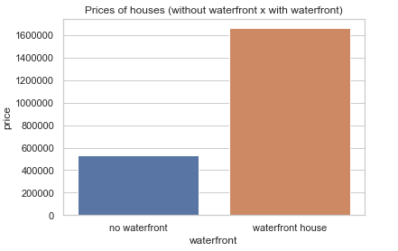
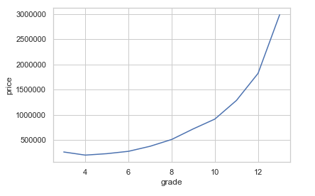
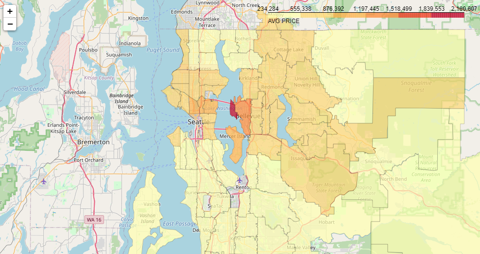

# House Rocket

Disclaimer: Este é um projeto fictício. A empresa, o contexto e as perguntas de negócios não são reais e não têm objetivo comercial. O Dataset público está disponível no [Kaggle](https://www.kaggle.com/harlfoxem/housesalesprediction).

Este projeto é um desafio da [Comunidade DS](https://www.comunidadedatascience.com/).

## 1. Problema de negócios
### 1.1 Problema
House Rocket é uma empresa de tecnologia do setor imobiliário que utiliza uma plataforma digital para promover a compra e venda de propriedades. Ela trabalha com um portfólio próprio e também promove a venda de imóveis de terceiros, em um modelo de negócio de marketplace.

Diante da grande competitividade do setor, o CEO da empresa gostaria que seu time comercial identificasse as melhores oportunidades de casas abaixo do preço de mercado e com um bom potencial de valor de venda. Dessa forma, a empresa poderá expandir seu portfólio de imóveis, além de potencializar o seu lucro quando concretizada a venda das propriedades. 

O time comercial, acionou a equipe de data science da empresa, para de forma conjunta, apresentarem uma solução alinhada ao objetivo do CEO.

### 1.2 Objetivo

O objetivo deste projeto é criar insights através da análise de dados para ajudar os tomadores de decisão a encontrar as melhores oportunidades de negócios no mercado imobiliário de King County, Seattle - USA (área de atuação da House Rocket).

### 1.3 Demandas
Produto de dados solicitado: 
* Dashboard interativo do portfólio disponível, com todas informações mais relevantes disponíveis atualmente, para que o CEO e o time de negócios  possa realizar análises (self-service BI).
   
* Respostas para duas questões:
  - 1 - Quais são os imóveis que deveríamos comprar?
  - 2 - Uma vez o imóvel comprado, qual o melhor momento para vendê-lo, e por qual preço?
 

## 2. Premissas

- O dataset apresenta somente imóveis residenciais, por isso foram excluídas as propriedades com número de banheiros igual a 0.
- Existe uma observação onde o numero de quartos é igual a 33 para uma área pequena (1620 pés quadrados), o que indica com alta probabilidade um erro de digitação, por isso ela foi excluída
- Todos os produtos de dados entregues devem ser acessíveis via internet.
- O planejamento da solução será validado com os times de negócio, visando garantir que as soluções desenvolvidas são úteis na sua tomada de decisão.

As variáveis do dataset original são:

Variável | Definição
------------ | -------------
|id | Identificador de cada imóvel.|
|date | Data em que a imóvel ficou disponível.|
|price | O preço de cada imóvel, considerado como preço de compra.|
|bedrooms | Número de quartos.|
|bathrooms | O número de banheiros, o valor 0,5 indica um quarto com banheiro, mas sem chuveiro. O valor 0,75 ou 3/4 banheiro representa um banheiro que contém uma pia, um vaso sanitário e um chuveiro ou banheira.|
|sqft_living | Pés quadrados do interior das casas.|
|sqft_lot | Pés quadrados do terreno das casas.|
|floors | Número de andares.|
|waterfront | Uma variável fictícia para saber se a casa tinha vista para a orla ou não, '1' se o imóvel tem uma orla, '0' se não.|
|view | Vista, Um índice de 0 a 4 de quão boa era a visualização da imóvel.|
|condition | Um índice de 1 a 5 sobre o estado das moradias, 1 indica imóvel degradado e 5 excelente.|
|grade | Uma nota geral é dada à unidade habitacional com base no sistema de classificação de King County. O índice de 1 a 13, onde 1-3 fica aquém da construção e design do edifício, 7 tem um nível médio de construção e design e 11-13 tem um nível de construção e design de alta qualidade.|
|sqft_above | Os pés quadrados do espaço habitacional interior acima do nível do solo.|
|sqft_basement | Os pés quadrados do espaço habitacional interior abaixo do nível do solo.|
|yr_built | Ano de construção da imóvel.|
|yr_renovated | Representa o ano em que o imóvel foi reformado. Considera o número ‘0’ para descrever as imóvel nunca renovadas.|
|zipcode | Um código de cinco dígitos para indicar a área onde se encontra a imóvel.|
|lat | Latitude.|
|long | Longitude.|
|sqft_living15 | O tamanho médio em pés quadrados do espaço interno de habitação para as 15 casas mais próximas.|
|sqft_lot15 | Tamanho médio dos terrenos em metros quadrados para as 15 casas mais próximas.|

## 3. Planejamento da solução
### 3.1. Produto final 

- Um dashboard interativo acessível via navegador, que dê autonomia ao time comercial para realizar suas próprias análises.
- Uma planilha com os imóveis recomendados para a compra, identificados pelo seu ID e com a sugestão de seus preços de venda
  
### 3.2. Ferramentas 
Quais ferramentas foram usadas no processo?
- Visual Studio code;
- Jupyter Notebook;
- Git, Github;
- Python;
- Streamlit;
- Heroku.

### 3.3. Estratégia de Solução

* 1 - Foram importadas as bibliotecas Python que auxiliaram na desenvolvimento da solução
* 2 - Foi coletado no Kagle o dataset original contendo todos os dados de todos imóveis mapeados pela House Rocket
* 3 - Foi realizada uma limpeza nos dados
* 4 - Foi feita uma Análise Exploratória nos dados, nela foram extraídos Insights que serviram de insumo para a criação de uma regra de negócios direcionada à identificação de oportunidade de compra e venda de imóveis
* 5 - Foi elaborada uma regra de negócios
  * 5.1 - Agrupamento de imóveis pelos critérios mais significativos da EDA : Código Postal, Reforma, Vista para a água e nota do imóvel
  * 5.2 - Calculo da mediana de preços de cada grupo, além da quantidade de residências que cada um possui
  * 5.3 - Filtragem de agrupamentos, sendo selecionados somente grupos com mais de 100 casas, para que grupos de poucas residências não fossem capaz de enviesar a regra de negócios
  * 5.4 - O preço de cada imóvel foi comparado individualmente com a mediana de seu grupo, em busca das melhores oportunidades de preço de revenda. Os imóveis foram ordenados da maior para a menor diferença de preços
  * 5.5 - Foi criada uma coluna na base que definiu a recomendação de compra para cada imóvel. O critério utilizado foi o seguinte: Caso fosse aplicada uma margem de lucro de 30% naquele imóvel e ele continuasse com o preço abaixo da mediana do seu grupo seria recomendada a compra, caso contrário, não.
* Foram calculados custos e receitas dessa operação

  
## 4. Os 3 principais insights dos dados

Durante a análise exploratória de dados, foram gerados insights ao time de negócio, através da validação das hipóteses.

#### Hipótese 1 - Imóveis que possuem vista para água são  mais caros na média

Hipótese verdadeira, imóveis com vista para o mar são, em média, 212.57% mais caros que os sem vista.
 
 * Insight de negócio: Procurar em outra base de dados as datas de anúncio dos imóveis com vista para água e datas de venda. Caso esse tipo de imóvel tenha um bom giro, dar preferência para a compra. Aliar outros critérios relevantes como a nota, área do imóvel e reforma para a tomada de decisão.

#### Hipótese 2 - A nota atribuída ao imóvel impacta positivamente o seu valor

Hipótese verdadeira, ao observar o gráfico acima, podemos enxergar uma relação exponencial entre a nota atribuída ao imóvel e o preço deste.

  * Insight de negócio: Utilizar a segmentação por nota do imóvel na construção de regra de negócio

#### Hipótese 3 - A localização do imóvel impacta no seu preço

Hipótese verdadeira, pois pelo mapa de calor, podemos perceber regiões agrupadas por código postal(CEP) que têm uma média de 
preço de imóveis muito superior em relação à outras

  * Insight de negócio: Definir com um time comercial uma estratégia ( diversificação do portfólio de imóveis x concentração em uma determinada região) para priorizar a compra dos imóveis recomendados.

#### Hipótese 4 - Imóveis que em algum momento foram reformados se valorizam na hora da venda

Hipótese verdadeira, pois em média os imóveis reformados se valorizam 43% em relação aos que nunca passaram por uma reforma
  
  * Estudar a viabilidade de comprar casas que nunca sofreram reformas, reforma-las (aumentando suas notas) e revende-las

## 5. Resultados financeiros para o negócio
De acordo com os critérios definidos, foram sugeridos os imóveis com as seguintes condições para a compra: 

* Preço da propriedade * 1,43 (na conta reversa dá uma margem de 30%) abaixo da mediana de seu cluster. O cluster foi definido pelo agrupamento dos seguintes critérios do dataset:Código Postal, Reforma, Vista para a água e Nota do imóvel;

Também foi observado que existe sazonalidade no preço de vendas, de forma geral, o preço dos imóveis é menor no inverno e maior na primavera. Apresentando uma diferença de aproximadamente 6% entre essas duas estações. Fica a recomendação dessas 2 estações para compra e venda (respectivamente).

Ao aplicar todas os critérios da regra de negócio,  foram selecionadas 598 propriedades para a recomendação de compra, essas foram ordenadas da maior para o menor diferença de preço em relação a mediana do grupo.
Caso todos imóveis selecionados fossem comprados, depois vendidos pelo preço sugerido onde foi aplicada uma margem de 30%, essa operação geraria:

A receita total de : R$ 214.856.155,80
O custo de : R$ 150.249.060,00
O lucro de: R$ 64.607.095,80

## 5. Conclusão

O objetivo do projeto foi alcançado, dado que os produtos de dados propostos foram gerados com sucesso (Dashboard e Planilha). Os times já podem utilizar a solução para a tomada de decisão na House Rocket.

- Abaixo, segue uma demonstração do dashboard produzido. Caso queira acessá-lo, basta clicar no link: [Heroku_App] (https://analytics-h.herokuapp.com/).

- A planilha fica disponível no repositório do projeto, e caso queira acessá-la: basta clicar no link: [Planilha] ().

## 7. Próximoss passos

Algumas melhorias nos dashboard podem ser incrementadas no futuro:

* Desenvolver uma solução de Machine Learning para prever com maior acurácia os preços de venda dos imóveis, objetivando aumentar a margem média de lucro.
* Implementar um código de Geopandas para buscar os bairros dos imóveis e melhorar o filtro do CEO.
* Recomendar a compra de imóveis na baixa temporada e vendê-los na alta. Levando em consideração que as estações do 
ano inverno e outono os preços dos imóveis estão mais desvalorizados e as estações do ano primavera e verão são as 
estações que os imóveis estão mais valorizados.   

## 6 Referências

* O Dataset foi obtido no [Kaggle](https://www.kaggle.com/harlfoxem/housesalesprediction).

* Os significados das variáveis foram obtidos no [Geocenter](https://geodacenter.github.io/data-and-lab/KingCounty-HouseSales2015/).

* A imagem de capa é de uso livre e foi obtida no [Unsplash] (https://unsplash.com/).

